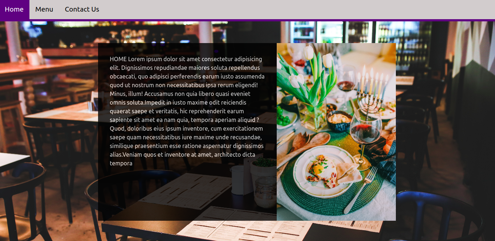

# Restaurant-JS
A restaurant landing page build with JS

# JavaScript Restaurant Page Tab switching

> Display content of each tab only using JavaScript.

This app was built with JavaScript, HTML and CSS

## Built With

- JavaScript, HTML & CSS
- WebPack
- Sass

## Live Demo
[Live link here](https://rawcdn.githack.com/EricMbouwe/Restaurant-JS/c2c4eea0e7522134d0803c08f2a2cb5a67664323/dist/index.html)

## Getting Started

To get a local copy up and running follow these simple example steps.

### Prerequisites

Have a browser installed

### Setup

Clone this repo with <code>git clone git@github.com:ericmbouwe/restaurant-page.git</code>

### Usage

1. <code>cd</code> into the project directory
2. run <code>npm install</code>
3. Open index.html in the dist/ folder in a browser and enjoy :smiley:

## Authors

:bust_in_silhouette: **Eric Mbouwe**

- Github: [ericmbouwe](https://github.com/ericmbouwe)
- LinkedIn: [Eric Mbouwe](www.linkedin.com/in/ericmbouwe)

## 🤝 Contributing

Contributions, issues and feature requests are welcome!

Feel free to check the [issues page](https://github.com/ericmbouwe/restaurant-page/issues).

## Show your support

Give a ⭐️ if you like this project!

## Acknowledgments

- Hat tip to anyone whose code was used
- Inspiration
- etc

## 📝 License

This project is [MIT](lic.url) licensed.